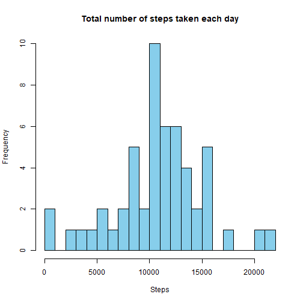
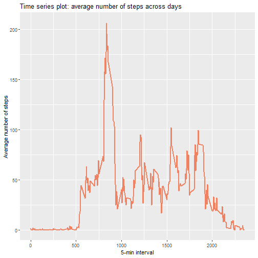
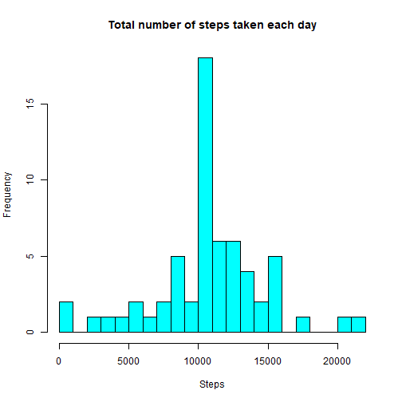
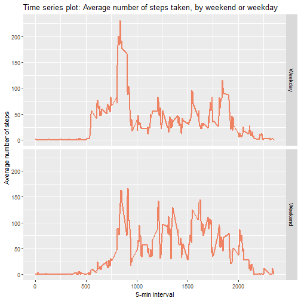

# **Course Project I**

===================

## Loading the data


```r
data <- read.csv("C:/Users/ddelp/OneDrive/Escritorio/activity.csv")
```


## Exploring the data


```r
str(data)
```

```
## 'data.frame':	17568 obs. of  3 variables:
##  $ steps   : int  NA NA NA NA NA NA NA NA NA NA ...
##  $ date    : chr  "2012-10-01" "2012-10-01" "2012-10-01" "2012-10-01" ...
##  $ interval: int  0 5 10 15 20 25 30 35 40 45 ...
```

```r
summary(data)
```

```
##      steps            date              interval     
##  Min.   :  0.00   Length:17568       Min.   :   0.0  
##  1st Qu.:  0.00   Class :character   1st Qu.: 588.8  
##  Median :  0.00   Mode  :character   Median :1177.5  
##  Mean   : 37.38                      Mean   :1177.5  
##  3rd Qu.: 12.00                      3rd Qu.:1766.2  
##  Max.   :806.00                      Max.   :2355.0  
##  NA's   :2304
```


## Total number of steps taken each day

We remove missing values first and then get the number of steps taken each day, mean and median


```r
library(dplyr)
```

```
## 
## Attaching package: 'dplyr'
```

```
## The following objects are masked from 'package:stats':
## 
##     filter, lag
```

```
## The following objects are masked from 'package:base':
## 
##     intersect, setdiff, setequal, union
```

```r
data1 <- data[complete.cases(data), ]
results1 <- group_by(data1, date) %>% 
  summarise(total = sum(steps), mean = mean(steps), median = median(steps))
print (results1, n = 53)
```

```
## # A tibble: 53 x 4
##    date       total   mean median
##    <chr>      <int>  <dbl>  <dbl>
##  1 2012-10-02   126  0.438      0
##  2 2012-10-03 11352 39.4        0
##  3 2012-10-04 12116 42.1        0
##  4 2012-10-05 13294 46.2        0
##  5 2012-10-06 15420 53.5        0
##  6 2012-10-07 11015 38.2        0
##  7 2012-10-09 12811 44.5        0
##  8 2012-10-10  9900 34.4        0
##  9 2012-10-11 10304 35.8        0
## 10 2012-10-12 17382 60.4        0
## 11 2012-10-13 12426 43.1        0
## 12 2012-10-14 15098 52.4        0
## 13 2012-10-15 10139 35.2        0
## 14 2012-10-16 15084 52.4        0
## 15 2012-10-17 13452 46.7        0
## 16 2012-10-18 10056 34.9        0
## 17 2012-10-19 11829 41.1        0
## 18 2012-10-20 10395 36.1        0
## 19 2012-10-21  8821 30.6        0
## 20 2012-10-22 13460 46.7        0
## 21 2012-10-23  8918 31.0        0
## 22 2012-10-24  8355 29.0        0
## 23 2012-10-25  2492  8.65       0
## 24 2012-10-26  6778 23.5        0
## 25 2012-10-27 10119 35.1        0
## 26 2012-10-28 11458 39.8        0
## 27 2012-10-29  5018 17.4        0
## 28 2012-10-30  9819 34.1        0
## 29 2012-10-31 15414 53.5        0
## 30 2012-11-02 10600 36.8        0
## 31 2012-11-03 10571 36.7        0
## 32 2012-11-05 10439 36.2        0
## 33 2012-11-06  8334 28.9        0
## 34 2012-11-07 12883 44.7        0
## 35 2012-11-08  3219 11.2        0
## 36 2012-11-11 12608 43.8        0
## 37 2012-11-12 10765 37.4        0
## 38 2012-11-13  7336 25.5        0
## 39 2012-11-15    41  0.142      0
## 40 2012-11-16  5441 18.9        0
## 41 2012-11-17 14339 49.8        0
## 42 2012-11-18 15110 52.5        0
## 43 2012-11-19  8841 30.7        0
## 44 2012-11-20  4472 15.5        0
## 45 2012-11-21 12787 44.4        0
## 46 2012-11-22 20427 70.9        0
## 47 2012-11-23 21194 73.6        0
## 48 2012-11-24 14478 50.3        0
## 49 2012-11-25 11834 41.1        0
## 50 2012-11-26 11162 38.8        0
## 51 2012-11-27 13646 47.4        0
## 52 2012-11-28 10183 35.4        0
## 53 2012-11-29  7047 24.5        0
```


## Mean and median total number of steps taken per day


```r
mean(results1$total)
```

```
## [1] 10766.19
```

```r
median(results1$total)
```

```
## [1] 10765
```


## Histogram of the total number of steps taken each day


```r
hist(results1$total, col = "skyblue", breaks = 20, main = "Total number of steps taken each day",
     xlab = "Steps")
```




## Time series plot of the 5-minute interval (x-axis) and the average number of steps taken, averaged across all days (y-axis)


```r
av_interval <- group_by(data1, interval) %>%
  summarise(mean_steps = mean(steps))
av_interval <- as.data.frame(av_interval)
```

First we group the data frame by interval and take the mean of "steps" variable.


```r
library(ggplot2)
plot1 <- ggplot(av_interval, aes(x = interval, y = mean_steps))
plot1 + geom_line(colour = "salmon2", size = 1) + labs (x = "5-min interval", 
                                                        y = "Average number of steps") +
  ggtitle("Time series plot: average number of steps across days")
```




## The 5-minute interval that, on average, contains the maximum number of steps

We use the data frame grouped by interval, then reorder our data so that the maximum value is first so we can select it.


```r
max_interval <- av_interval %>%
  arrange(desc(mean_steps)) %>%
  top_n(1) %>%
  select(interval)
```

```
## Selecting by mean_steps
```

```r
print(max_interval)
```

```
##   interval
## 1      835
```


## Code to describe and show a strategy for imputing missing data


### Total number of missing values in the data set

```r
summary(data)
```

```
##      steps            date              interval     
##  Min.   :  0.00   Length:17568       Min.   :   0.0  
##  1st Qu.:  0.00   Class :character   1st Qu.: 588.8  
##  Median :  0.00   Mode  :character   Median :1177.5  
##  Mean   : 37.38                      Mean   :1177.5  
##  3rd Qu.: 12.00                      3rd Qu.:1766.2  
##  Max.   :806.00                      Max.   :2355.0  
##  NA's   :2304
```

```r
sum(is.na(data$date))
```

```
## [1] 0
```

```r
sum(is.na(data$interval))
```

```
## [1] 0
```

```r
sum(is.na(data$steps))
```

```
## [1] 2304
```
There are 2304 NA values and only in variable "steps".

### Devise a strategy for filling in all of the missing values in the dataset. 
We are going to replace missing values of variable "steps" with the calculated mean by interval, in the data frame without missing values.
We will call this variable "steps_hat"


```r
imput_steps = group_by(data1, interval) %>%
  summarise(steps_hat = mean(steps))
imput_steps = as.data.frame(imput_steps)
```


### Create a new dataset that is equal to the original dataset but with the missing data filled in.
We merge our original data frame with the "steps_hat" variable and for those cases where there is a missing value, the variable "steps" will be substituted by the value of "steps_hat" (our imputed mean).


```r
data2 = left_join(data, imput_steps, by = "interval")
data2$steps_final = ifelse(is.na(data2$steps) == TRUE,
                           round(data2$steps_hat), 
                           data2$steps)
head(data2)
```

```
##   steps       date interval steps_hat steps_final
## 1    NA 2012-10-01        0 1.7169811           2
## 2    NA 2012-10-01        5 0.3396226           0
## 3    NA 2012-10-01       10 0.1320755           0
## 4    NA 2012-10-01       15 0.1509434           0
## 5    NA 2012-10-01       20 0.0754717           0
## 6    NA 2012-10-01       25 2.0943396           2
```

```r
sum(is.na(data2$steps_final))
```

```
## [1] 0
```
We check that there are no missing values.


### Make a histogram of the total number of steps taken each day and Calculate and report the mean and median total number of steps taken per day.


```r
results2 <- group_by(data2, date) %>%
  summarise(total2 = sum(steps_final))
hist(results2$total2, col = "cyan", breaks = 20, main = "Total number of steps taken each day",
     xlab = "Steps")
```



```r
mean(results2$total2)
```

```
## [1] 10765.64
```

```r
median(results2$total2)
```

```
## [1] 10762
```
The mean is the same as the mean from the first part of the assignment, and the median did not change much. Given that a lot of values are replaced with the mean, it makes sense that mean and median are similar. 

## Panel plot comparing the average number of steps taken per 5-minute interval across weekdays and weekends

### First create the factor variable weekend.


```r
data2$date = as.Date(data2$date)
data2$weekend = weekdays(data2$date)
table(data2$weekend)
```

```
## 
##   domingo    jueves     lunes    martes miércoles    sábado   viernes 
##      2304      2592      2592      2592      2592      2304      2592
```

```r
data2$weekend = factor (ifelse(data2$weekend %in% c("sábado","domingo"), 1, 0),
                        labels=c('Weekday', 'Weekend'))
table(data2$weekend)
```

```
## 
## Weekday Weekend 
##   12960    4608
```

### Panel plot


```r
results3 <- data2 %>%
  group_by(interval, weekend) %>%
  summarise(mean3 = mean(steps_final))
```

```
## `summarise()` has grouped output by 'interval'. You can override using the `.groups` argument.
```

```r
plot2 <- ggplot(results3, aes(interval, mean3))
plot2 + geom_line(colour = "salmon2", size = 1) + facet_grid(weekend ~ .) + labs(x = "5-min interval",
                                                                                 y = "Average number of steps") + ggtitle("Time series plot: Average number of steps taken, by weekend or weekday")
```




